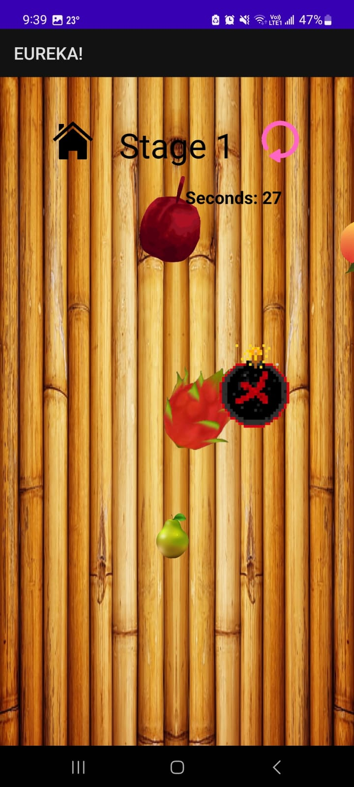
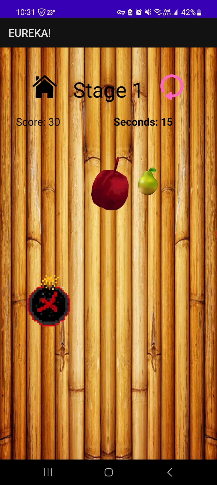
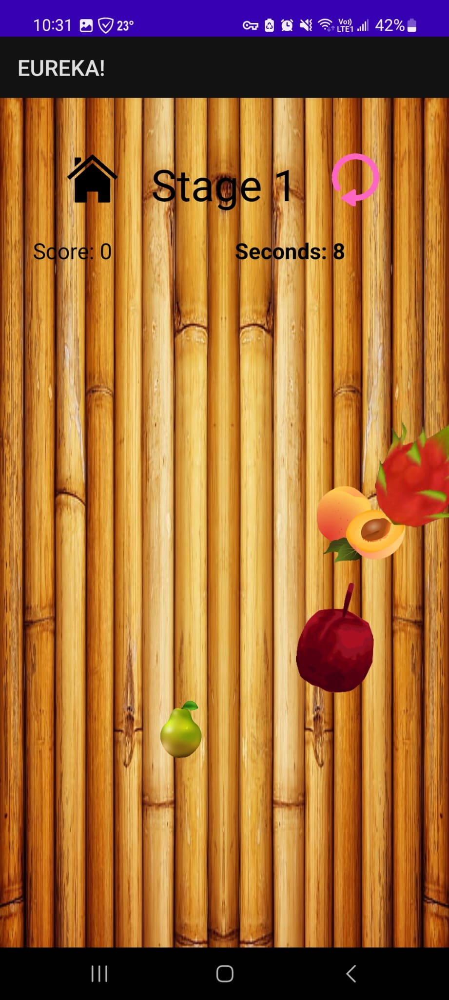
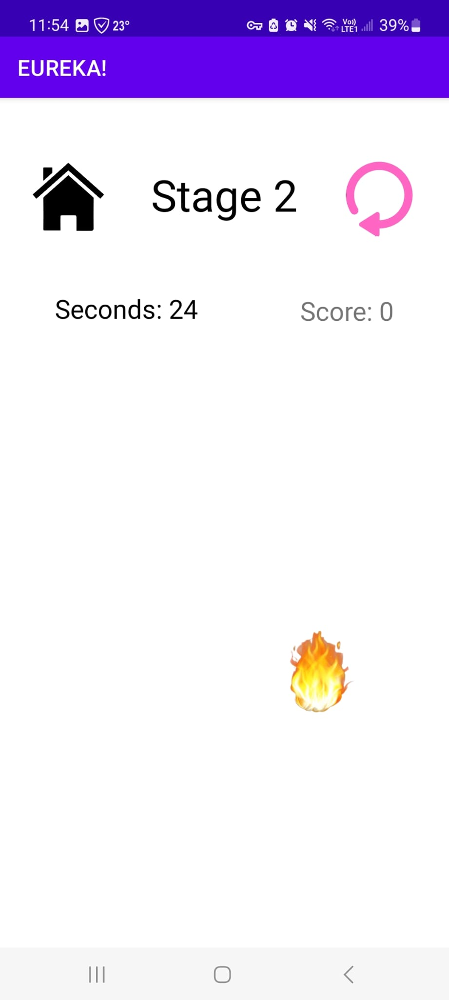
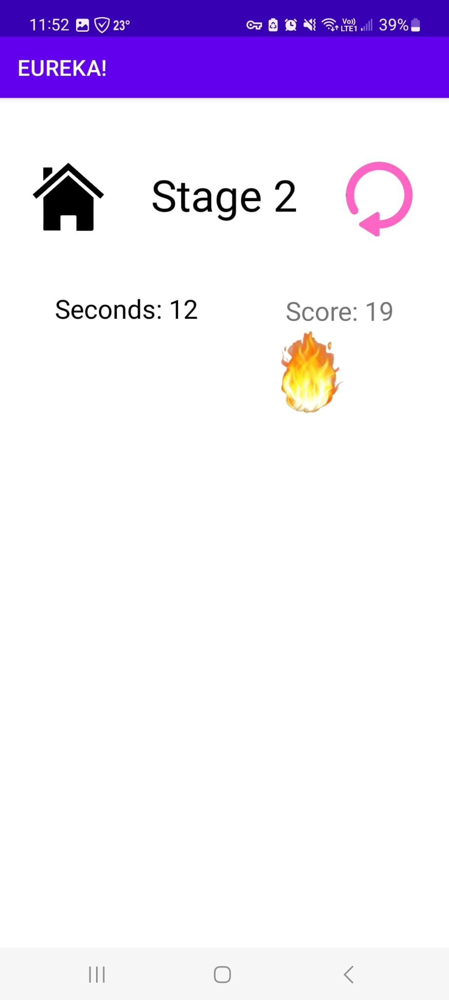
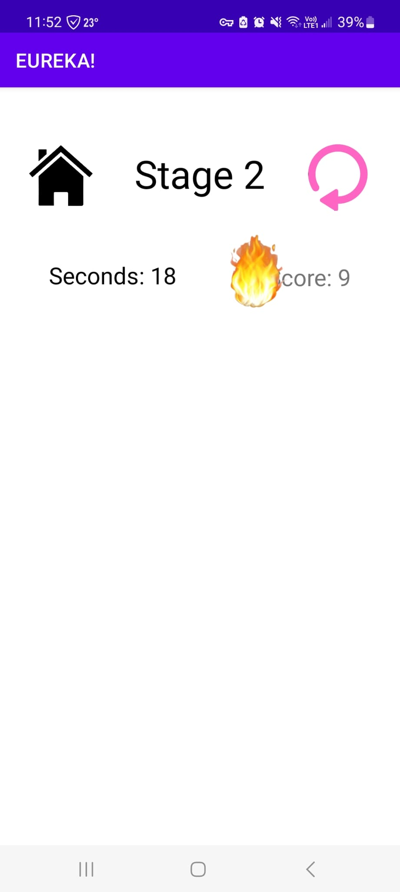
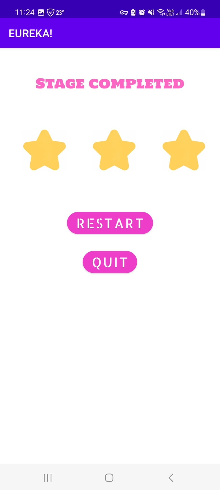
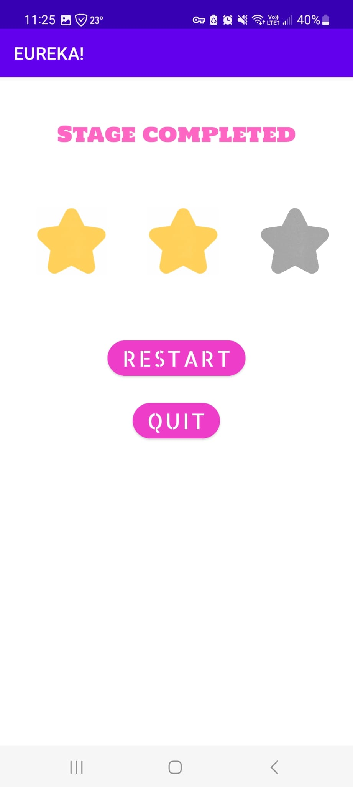
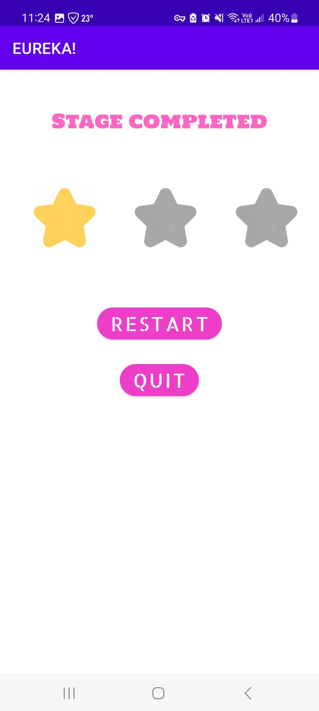

# Android-Game-Development
This is a Android Mobile Application project built in my Mobile Application Course

I was reponsible for Stage 1 [Fruit Game] and Stage 2 [Tap the Fire]

The goal of the game was to create games by utilizing different Android techniques

# My gameplay

## Fruit Game

### Instruction
- Fruits and bombs will appear in random locations on the screen.
- Try to avoid the bombs by not tapping them.
- Tap the fruits as quickly as possible to earn points.
- The game will continue until you tap a bomb or the timer runs out.
- Tap 30+ fruits to gain 3 stars, 20+ fruits for 2 starts, and 1+ fruits for 1 star

  

## Tap the Fire

### Instructions 

- The Fire will run into random direction
- Tap the fire as many times as possible before the game ends.
- Tap 20+ fire to gain 3 stars, 10+ fire for 2 starts, and 1+ fire for 1 star

  

## Stage Completed

  

# Team Mates
Tong 
- Responsible for Database, 
- Stage 5 [Help mom do the laundry] 
- Stage 6 [Finsih the Chinese Homework]

Sanjay
- Responsible for Game Stage 
- Menu Page, 
- Stage 1 [Fruit Game] 
- Stage 2 [Catch the File]

Vicky 

- Responsible for Game Completed page, 
- Dashbaord page, 
- Stage 3 [Rescure the Cat] 
- Stage 4 [Counting Hair] 

Liam

- Reponsible for Home Page, 
- Stage 7 [Type the Correct Answer] 
- Stage 8 [Stop the timer at 15 seconds]

# Warnings

- Certain stages may not be playable
- Database amy not be functional
 
